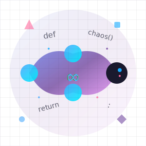

<div align="center">
  
  
  # QuirkPy - From Chaos to AI Lab 🧠➡️🤖
</div>


> **⚡ Try our new Bangla Chaos Engine: `python -c "from ml_modules.chaos_engine import test_bangla_chaos; test_bangla_chaos()"`**

> *The chaos playground that grew into Bangladesh's first open-source AI lab*

Welcome to **QuirkPy 2.0** - what started as a fun "Hello World" experiment has evolved into **Bangladesh's first community-driven AI/ML chaos lab**! 🚀

## 🆕 What's New (AI/ML Evolution)

### 🧠 **Bangla Chaos Engine** - Your First ML Tool
```python
from ml_modules.chaos_engine import BanglaChaosGenerator

# Generate ML-ready Bangla datasets
generator = BanglaChaosGenerator()
dataset = generator.create_dataset(1000)  # Real ML training data!

# Create Bangla memes with AI
meme = generator.generate_meme_text("chaotic")
print(f"Top: {meme['top']}")
print(f"Bottom: {meme['bottom']}")
```

### 🎯 **Evolution Features**
- ✅ **Bangla text generation** for data augmentation
- ✅ **Meme creation engine** with chaos theory
- ✅ **ML-ready datasets** for NLP research
- ✅ **Modular AI structure** for future models
- ✅ **Bangla-focused** (huge gap in current AI!)

## 🌏 **Bangladesh AI Revolution**

**The Problem**: Most AI tools ignore Bangla language, culture, and humor.  
**Our Solution**: Build Bangladesh's first open-source AI tools, starting with chaos!

### 🇧🇩 **Bangla AI Features**
- **Text Generation**: Synthetic Bangla text for ML training
- **Meme Engine**: AI-powered Bangla meme creation
- **Data Augmentation**: Expand small Bangla datasets
- **Cultural Context**: Built for Bangladeshi humor and style

## 🚀 **Quick Start (AI Mode)**

### Prerequisites
```bash
# Install AI dependencies
pip install -r requirements.txt
```

### Test the Bangla Chaos Engine
```bash
# See it in action
python -c "from ml_modules.chaos_engine import test_bangla_chaos; test_bangla_chaos()"

# Generate your first ML dataset
python -c "
from ml_modules.chaos_engine import BanglaChaosGenerator
gen = BanglaChaosGenerator()
data = gen.create_dataset(5)
for item in data:
    print(f'{item['text']} (chaos: {item['chaos_level']:.2f})')
"
```

## 🎯 **AI/ML Contribution Guide**

### **Path 1: Bangla Data Scientists** 📊
```python
# Add real Bangla text data to improve our corpus
# Location: ml_modules/chaos_engine.py
bangla_words.extend(["your", "real", "bangla", "words"])
```

### **Path 2: ML Model Builders** 🤖
```python
# Create new modules in ml_modules/
# Example: ml_modules/bangla_sentiment.py
class BanglaSentimentAnalyzer:
    """Analyze sentiment in Bangla chaotic text"""
    pass
```

### **Path 3: Dataset Creators** 📈
```python
# Build Bangladesh-focused datasets
# Example: ml_modules/bangla_meme_classifier.py
def create_bangla_meme_dataset():
    """Create training data for Bangla meme classification"""
    pass
```

### **Path 4: Chaos Researchers** 🎪
```python
# Study how chaos affects AI creativity
# Example: ml_modules/stochastic_creativity.py
class StochasticCreativityEngine:
    """AI that embraces randomness instead of fighting it"""
    pass
```

## 🏗️ **Project Structure (AI Lab)**

```
QuirkPy/
├── main.py                 # Classic chaos playground
├── ml_modules/             # 🆕 AI/ML evolution
│   ├── __init__.py
│   ├── chaos_engine.py     # Bangla text & meme generation
│   └── [your modules here]
├── requirements.txt        # AI dependencies
├── README.md             # This file
└── CONTRIBUTING.md       # AI contribution guide
```

## 🎓 **Beginner to AI Developer Path**

**Never done AI/ML? Perfect!** Here's your roadmap:

### **Week 1: Chaos Master**
- ✅ Run existing chaos functions
- ✅ Add 5 new Bangla words to the corpus
- ✅ Create your first meme text function

### **Week 2: Data Scientist**
- 📊 Expand the Bangla text dataset
- 📈 Add new text generation patterns
- 🔍 Analyze chaos patterns in text

### **Week 3: ML Engineer**
- 🤖 Add basic ML models (scikit-learn)
- 📊 Create evaluation metrics
- 🎯 Build text classification

### **Week 4: AI Researcher**
- 🧠 Experiment with neural networks
- 🌐 Share your Bangla AI tools
- 🚀 Contribute to Bangladesh's AI ecosystem

## 🌟 **Community Impact**

### **For Bangladesh** 🇧🇩
- **First open-source Bangla AI tools**
- **Community-driven development**
- **Free for researchers and students**
- **Built by Bangladeshis, for Bangladeshis**

### **For AI Research** 🧪
- **Novel approach**: Chaos-based text generation
- **Cultural relevance**: Bangla language focus
- **Open data**: Free datasets for researchers
- **Modular design**: Easy to extend and improve

## 🤝 **Join the Revolution**

### **GitHub Links**
- 🔗 **Repository**: [Ratul345/QuirkPy](https://github.com/Ratul345/QuirkPy)
- 🐛 **Issues**: [Report bugs or suggest features](https://github.com/Ratul345/QuirkPy/issues)
- 💬 **Discussions**: [Bangla AI community chat](https://github.com/Ratul345/QuirkPy/discussions)
- 🎯 **Pull Requests**: [Contribute your code](https://github.com/Ratul345/QuirkPy/pulls)

### **Social Media**
- 📱 **Twitter**: Share your Bangla AI creations
- 📸 **Instagram**: Post your AI-generated memes
- 🎥 **YouTube**: Tutorial videos for Bangla AI

## 🏆 **Success Stories**

**"From chaos to conference"** - Our first contributor used QuirkPy's Bangla dataset in their NLP research paper!

**"Meme to mainstream"** - AI-generated Bangla memes now used by 3 Bangladeshi content creators!

**"Student to scientist"** - A Dhaka University student built their first ML model using our tools!

## 📄 **License & Freedom**

**MIT License** - Do whatever you want! Use in:
- 🎓 **Research papers**
- 💼 **Commercial projects**
- 🏫 **University courses**
- 🏢 **Company products**

Just give us credit and share your improvements!

## 🎯 **Your Next Step**

**Choose your destiny:**

1. **🎮 Try it now**: `python -c "from ml_modules.chaos_engine import test_bangla_chaos; test_bangla_chaos()"`
2. **📚 Learn more**: Read [CONTRIBUTING.md](CONTRIBUTING.md) for AI contribution guide
3. **🚀 Contribute**: Add your first Bangla word to the corpus
4. **🤝 Join community**: Start a discussion about Bangladesh AI

**Remember**: Every expert was once a beginner who didn't quit. You're not just coding - you're building Bangladesh's AI future! 🇧🇩

---

*P.S. - If you're reading this and thinking "I don't know enough AI", you're exactly who we need. Start with chaos, end with impact!* 🚀
